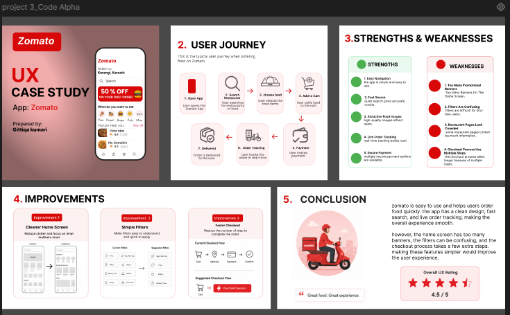

# Project 3 - UX Case Study

This project was completed as part of my CodeAlpha UI/UX Design Internship.

## Project Overview

The purpose of this project was to document the complete UX design process, including problem identification, user research, wireframing, high-fidelity design, and the final prototype. The case study explains the design decisions and the overall user experience.
## Preview

## PDF

[View Project PDF](./project3.pdf)

## Figma Design

https://www.figma.com/design/DQKU6qhrx4sd0uql0SD3xq/projects_CodeAlpha?node-id=124-2342&t=pcDcZ9mW27GqwbCI-1

## Tools Used

- Figma
- User Research
- Wireframing
- UI Design
- Prototyping

## Created By

**Gittiqa Maheshwari**
